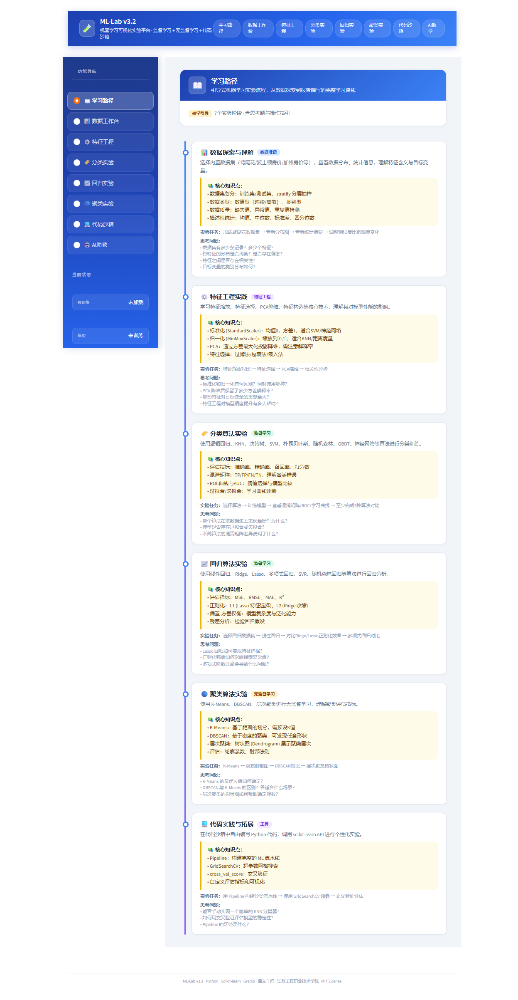
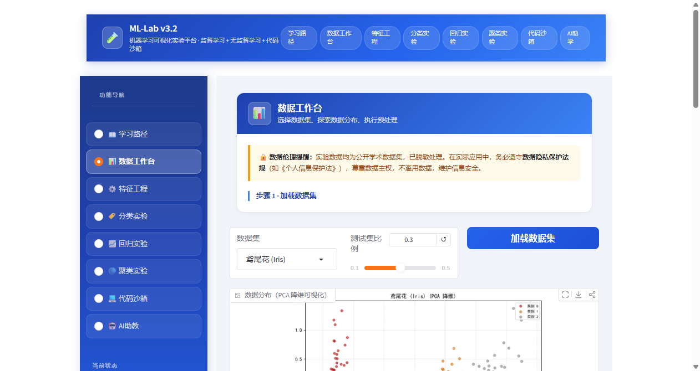
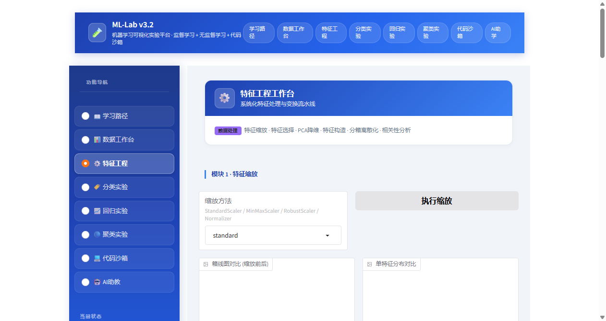
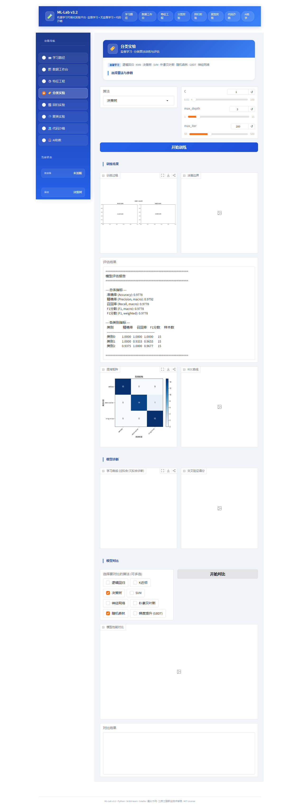
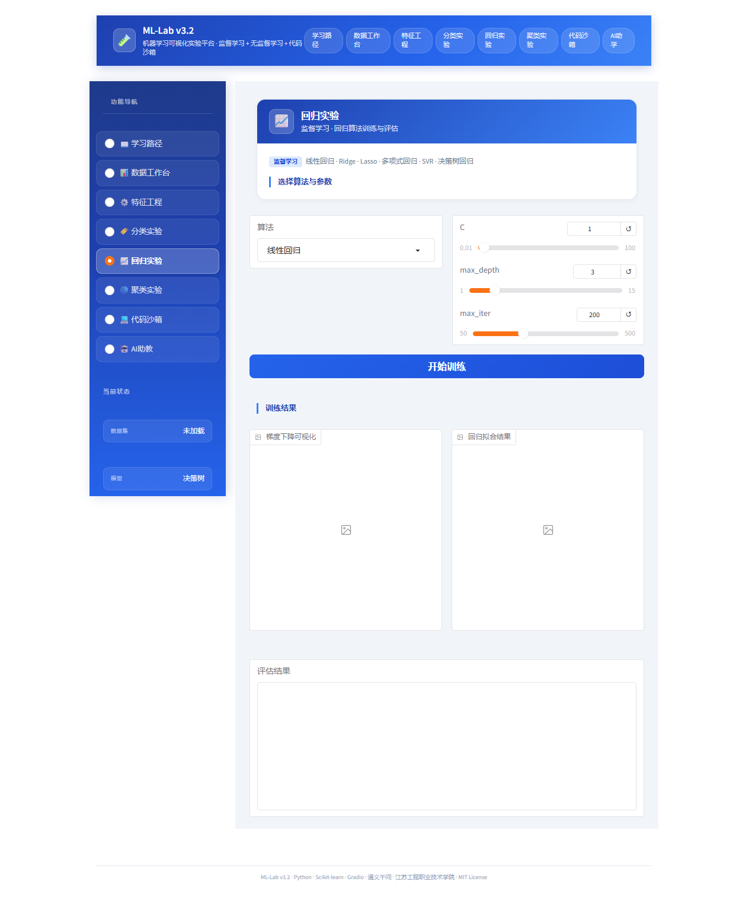
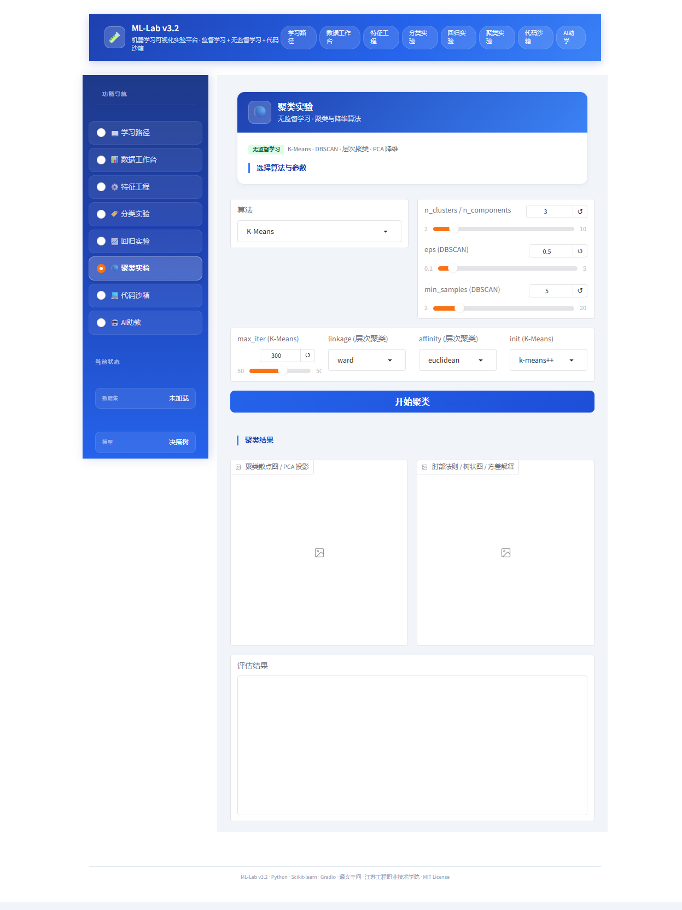
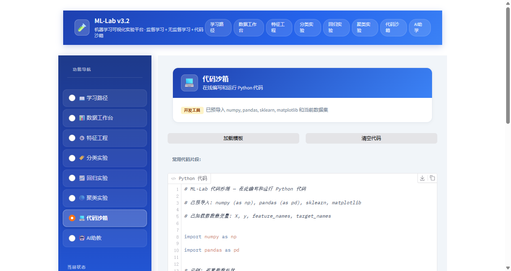
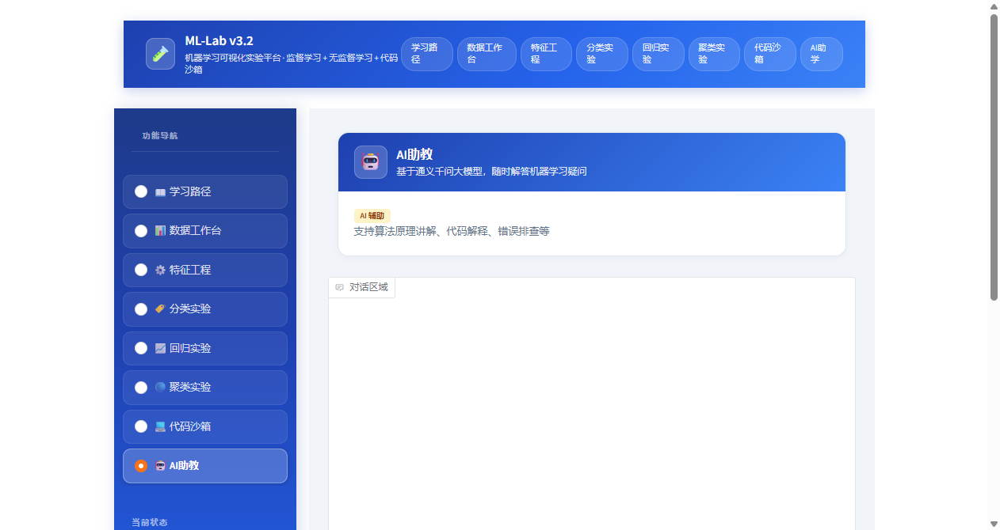

# ML-Lab

  

**面向高职教学的机器学习可视化实验平台**

> 通义千问大模型 AI 助教 | 江苏工程职业技术学院 · 南通市人工智能新质技术重点实验室

---

## 项目简介

ML-Lab 是一个面向高职院校"机器学习"课程教学的可视化实验平台，帮助学生通过交互式操作直观理解机器学习算法原理。平台集成 AI 智能助教（基于通义千问大模型），提供引导式学习路径、9 个公开数据集、15 种经典算法、特征工程工作台和在线代码沙箱。

---

## 功能模块

### 1. 学习路径

引导式 7 阶段实验流程，含核心知识点、实验任务和思考题，帮助学生循序渐进掌握机器学习完整流程。

### 2. 数据工作台

- **9 个内置公开数据集**：

  | 类型 | 数据集 |
  |------|--------|
  | 分类 | 鸢尾花 (Iris)、葡萄酒 (Wine)、乳腺癌 (Breast Cancer)、手写数字 (Digits) |
  | 回归 | 波士顿房价 (Boston)、加州房价 (California) |
  | 聚类 | 聚类球形 (Blobs)、聚类环形 (Circles)、合成分类数据 |

- 数据分布 PCA 降维可视化
- 训练集/测试集划分（可调比例）
- 数据摘要与统计信息
- 支持自定义 CSV 数据集

### 3. 特征工程

- 特征缩放：标准化 (StandardScaler)、归一化 (MinMaxScaler)
- 特征选择：单变量选择、递归特征消除 (RFE)、基于模型的特征选择
- PCA 降维：主成分分析，可视化方差解释率
- 相关性分析

### 4. 分类实验

8 种分类算法，支持参数调节与实时可视化：

| 算法 | 核心可视化 |
|------|-----------|
| 逻辑回归 | 决策边界、Sigmoid 函数 |
| KNN | K 值影响、决策边界 |
| 决策树 | 树结构可视化、特征重要性 |
| SVM | 支持向量、核函数对比 |
| 朴素贝叶斯 | 概率分布、决策边界 |
| 随机森林 | 特征重要性、多树对比 |
| 梯度提升 (GBDT) | 提升过程、损失曲线 |
| 神经网络 | 损失曲线、网络结构、学习率影响 |

评估指标：混淆矩阵、ROC 曲线、学习曲线、准确率/精确率/召回率/F1

### 5. 回归实验

6 种回归算法：

| 算法 | 核心可视化 |
|------|-----------|
| 线性回归 | 拟合直线、梯度下降过程 |
| Ridge 回归 | L2 正则化效果对比 |
| Lasso 回归 | L1 正则化、特征稀疏性 |
| 多项式回归 | 多项式拟合对比 |
| SVR 回归 | 核函数对比 |
| 决策树回归 | 树结构、拟合可视化 |

### 6. 聚类实验

3 种无监督学习算法：

| 算法 | 核心可视化 |
|------|-----------|
| K-Means | 肘部图、聚类散点图 |
| DBSCAN | eps 参数分析、密度分布 |
| 层次聚类 | 树状图 (Dendrogram) |

### 7. 代码沙箱

在线编写和运行 Python 代码，调用 scikit-learn API 进行个性化实验，支持自定义数据分析与模型训练。

### 8. AI 助教

基于通义千问大模型的智能问答系统：
- 算法原理讲解
- 代码解释与错误排查
- 按算法分类的常见问题推荐

## 界面截图

<table>
<tr>
<td></td>
</tr>
<tr>
<td align="center"><b>图1：学习路径</b> — 引导式7阶段实验流程，含知识点与思考题</td>
</tr>
</table>

<table>
<tr>
<td></td>
</tr>
<tr>
<td align="center"><b>图2：数据工作台</b> — 内置9个公开数据集，数据分布与PCA可视化</td>
</tr>
</table>

<table>
<tr>
<td></td>
</tr>
<tr>
<td align="center"><b>图3：特征工程</b> — 特征缩放、选择、PCA降维与相关性分析</td>
</tr>
</table>

<table>
<tr>
<td></td>
</tr>
<tr>
<td align="center"><b>图4：分类实验</b> — 8种分类算法，含评估报告、混淆矩阵与模型对比</td>
</tr>
</table>

<table>
<tr>
<td></td>
</tr>
<tr>
<td align="center"><b>图5：回归实验</b> — 6种回归算法，拟合可视化与残差分析</td>
</tr>
</table>

<table>
<tr>
<td></td>
</tr>
<tr>
<td align="center"><b>图6：聚类实验</b> — K-Means/DBSCAN/层次聚类，肘部图与树状图</td>
</tr>
</table>

<table>
<tr>
<td></td>
</tr>
<tr>
<td align="center"><b>图7：代码沙箱</b> — 在线Python编程，调用scikit-learn API</td>
</tr>
</table>

<table>
<tr>
<td></td>
</tr>
<tr>
<td align="center"><b>图8：AI助教</b> — 基于通义千问大模型的智能问答系统</td>
</tr>
</table>

---

## 技术栈

- **前端框架**：[Gradio](https://gradio.app/)
- **机器学习**：[Scikit-learn](https://scikit-learn.org/)
- **数据可视化**：[Matplotlib](https://matplotlib.org/)
- **AI 助教**：通义千问 (DashScope API)
- **语言**：Python 3.10+

---

## 快速开始

### 环境要求

- Python 3.10+
- 无需 GPU

### 安装步骤

1. **克隆项目**：

```bash
git clone https://github.com/jakejrc/ML-Lab.git
cd ML-Lab
```

2. **安装依赖**：

```bash
pip install -r requirements.txt
```

3. **配置 AI 助教 API Key**（可选，不配置不影响其他功能）：

```bash
# Windows
set DASHSCOPE_API_KEY=your_api_key_here

# Linux / macOS
export DASHSCOPE_API_KEY=your_api_key_here
```

> 免费获取 API Key：[阿里云百炼平台](https://dashscope.aliyun.com/)

4. **启动平台**：

```bash
python app.py
```

5. **打开浏览器访问**：http://localhost:7860

---

## Docker 部署

### 一键启动

```bash
docker run -d -p 7860:7860 --name ml-lab jakejrc/ml-lab:latest
```

### 配置 AI 助教

```bash
docker run -d -p 7860:7860 -e DASHSCOPE_API_KEY=your_api_key_here --name ml-lab jakejrc/ml-lab:latest
```

### 停止与删除

```bash
docker stop ml-lab && docker rm ml-lab
```

---

## 项目结构

```
ML-Lab/
├── app.py                    # Gradio 主界面
├── requirements.txt          # Python 依赖
├── Dockerfile                # Docker 构建文件
├── CHANGELOG.md              # 变更日志
├── VERSION                   # 版本号
├── ml_lab/                   # 核心算法包
│   ├── __init__.py           # 包初始化
│   ├── algorithms.py         # 15 种 ML 算法实现
│   ├── evaluation.py         # 模型评估与可视化
│   ├── feature_engineering.py # 特征工程模块
│   ├── llm_assistant.py      # AI 助教（通义千问）
│   ├── preprocessing.py      # 数据加载与预处理
│   └── visualization.py      # 图表绘制工具
└── docs/                     # 项目文档
    ├── 安装手册.html/docx
    ├── 使用手册.html/docx
    └── 开发记录.html/docx
```

---

## 作者

**姜荣昌** (jake_jrc)

江苏工程职业技术学院 · 南通市人工智能新质技术重点实验室

---

## 许可证

[MIT License](LICENSE)

---

## 致谢

- 通义千问大模型（AI 辅助开发与 AI 助教功能）
- [Scikit-learn](https://scikit-learn.org/)、[Gradio](https://gradio.app/)、[Matplotlib](https://matplotlib.org/) 等开源社区
