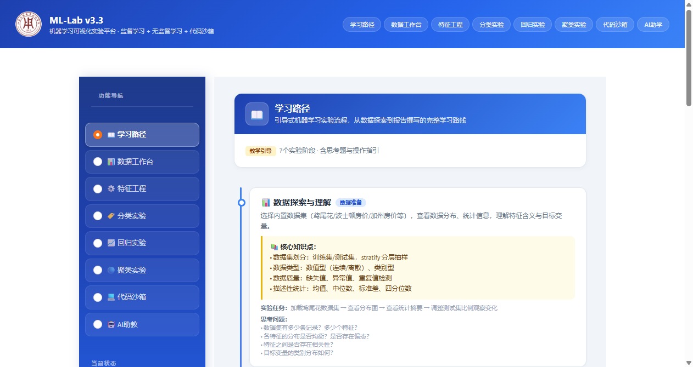
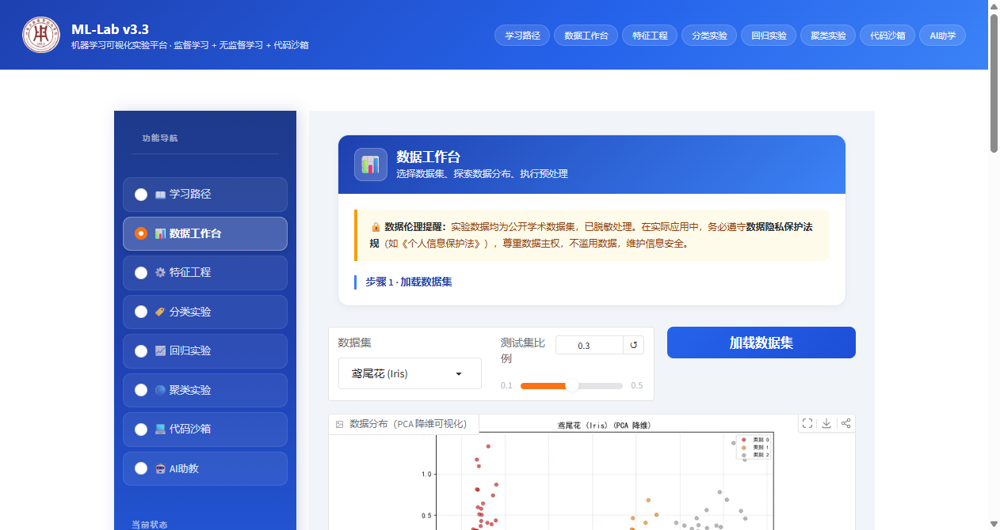
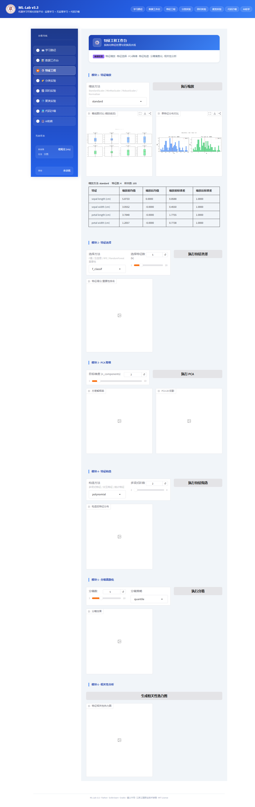
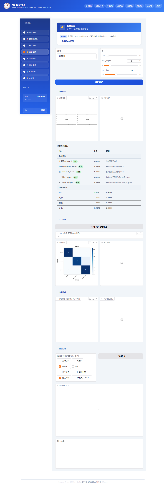
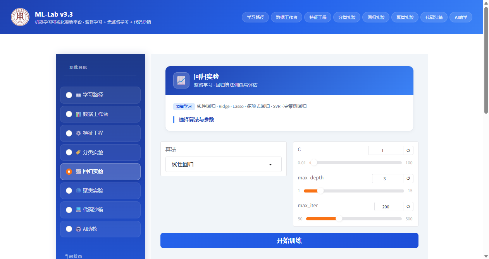
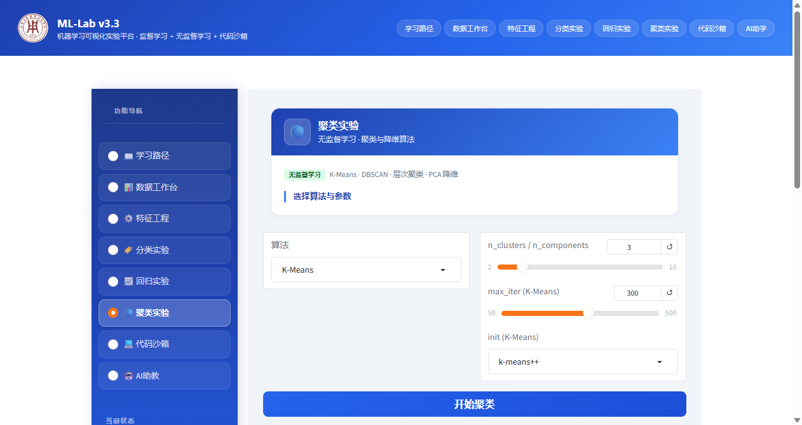

# ML-Lab v3.4

<p align="center">
  <strong>机器学习可视化实验平台</strong><br>
  Interactive Machine Learning Visualization Platform for Education<br>
  <em>15 种算法 · 9 个数据集 · 7 大模块 · AI 助教 · 代码沙箱</em>
</p>

<p align="center">
  
</p>

<p align="center">
  
  
  
</p>

<p align="center">
  
  
</p>

## 功能模块

| 模块 | 功能说明 |
|------|----------|
| 📖 学习路径 | 引导式实验流程，7 个阶段，含思考题与操作指引 |
| 📊 数据工作台 | 9 个公开数据集，数据分布可视化，统计信息表格展示，数据预处理对比 |
| ⚙️ 特征工程 | 特征缩放、特征选择（F值/互信息/RFE/RF）、PCA 降维、特征构造、分箱离散化、相关性分析，结果均以表格展示 |
| 🏷️ 分类实验 | 8 种算法（KNN/逻辑回归/SVM/决策树/朴素贝叶斯/随机森林/GBDT/神经网络），含评估表格、混淆矩阵、ROC 曲线、学习曲线、模型对比 |
| 📈 回归实验 | 4 种算法（线性回归/岭回归/决策树回归/随机森林回归），含评估表格、残差分析、正则化/多项式对比 |
| 🔵 聚类实验 | 3 种算法（K-Means/DBSCAN/层次聚类），动态参数面板，含评估表格、轮廓系数、肘部法则、树状图 |
| 💻 代码沙箱 | Python 代码编辑、执行、输出，支持一键生成训练代码 |
| 🤖 AI 助教 | 大语言模型对话辅助（通义千问） |

## v3.4 更新内容

- **全面表格化展示**：评估结果、数据信息、预处理结果、缩放统计、特征选择、PCA 分析、特征构造、分箱结果、相关性分析均改为结构化 HTML 表格
- **聚类参数动态显隐**：不同聚类算法显示对应参数面板，避免参数混淆
- **聚类参数布局优化**：算法选择与参数面板左右各占 50%
- **评估表格样式优化**：表头背景透明，分类评估含等级徽章和指标说明
- **数据信息表格化**：数据集元信息和统计特征以表格展示
- **特征工程结果表格化**：全部 6 个子模块的文本输出改为表格

## 技术栈

- **前端框架**：[Gradio](https://gradio.app/) 5.x
- **机器学习**：[Scikit-learn](https://scikit-learn.org/)
- **数据可视化**：[Matplotlib](https://matplotlib.org/)
- **AI 助教**：通义千问 (DashScope API)
- **语言**：Python 3.10+

---

## 快速开始

### 环境要求

- Python 3.10+
- 无需 GPU

### 安装步骤

1. **克隆项目**：

```bash
git clone https://github.com/jakejrc/ML-Lab.git
cd ML-Lab
```

2. **安装依赖**：

```bash
pip install -r requirements.txt
```

3. **配置 AI 助教 API Key**（可选，不配置不影响其他功能）：

```bash
# Windows
set DASHSCOPE_API_KEY=your_api_key_here

# Linux / macOS
export DASHSCOPE_API_KEY=your_api_key_here
```

> 免费获取 API Key：[阿里云百炼平台](https://dashscope.aliyun.com/)

4. **启动平台**：

```bash
python app.py
```

5. **打开浏览器访问**：http://localhost:7860

---

## Docker 部署

### 一键启动

```bash
docker run -d -p 7860:7860 --name ml-lab jakejrc/ml-lab:latest
```

### 配置 AI 助教

```bash
docker run -d -p 7860:7860 -e DASHSCOPE_API_KEY=your_api_key_here --name ml-lab jakejrc/ml-lab:latest
```

### 停止与删除

```bash
docker stop ml-lab && docker rm ml-lab
```

---

## 项目结构

```
ML-Lab/
├── app.py                    # Gradio 主界面
├── requirements.txt          # Python 依赖
├── Dockerfile                # Docker 构建文件
├── CHANGELOG.md              # 变更日志
├── VERSION                   # 版本号
├── ml_lab/                   # 核心算法包
│   ├── __init__.py           # 包初始化
│   ├── algorithms.py         # 15 种 ML 算法实现
│   ├── evaluation.py         # 模型评估与可视化（含表格生成）
│   ├── feature_engineering.py # 特征工程模块
│   ├── llm_assistant.py      # AI 助教（通义千问）
│   ├── preprocessing.py      # 数据加载与预处理
│   └── visualization.py      # 图表绘制工具
└── docs/                     # 项目文档与截图
    ├── screenshots_v34/      # v3.4 界面截图
    ├── 安装手册.html/docx
    ├── 使用手册.html/docx
    └── 开发记录.html/docx
```

---

## 作者

**姜荣昌** (jake_jrc)

江苏工程职业技术学院 · 南通市人工智能新质技术重点实验室

---

## 许可证

[MIT License](LICENSE)

---

## 致谢

- 通义千问大模型（AI 辅助开发与 AI 助教功能）
- [Scikit-learn](https://scikit-learn.org/)、[Gradio](https://gradio.app/)、[Matplotlib](https://matplotlib.org/) 等开源社区
